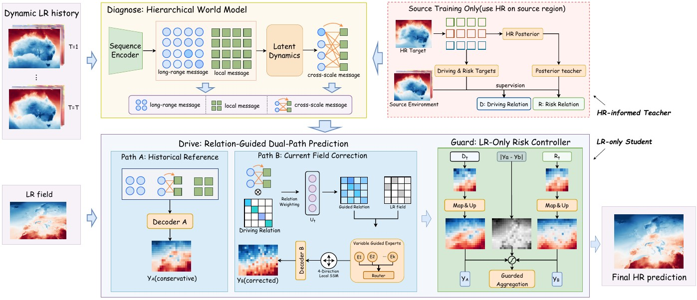
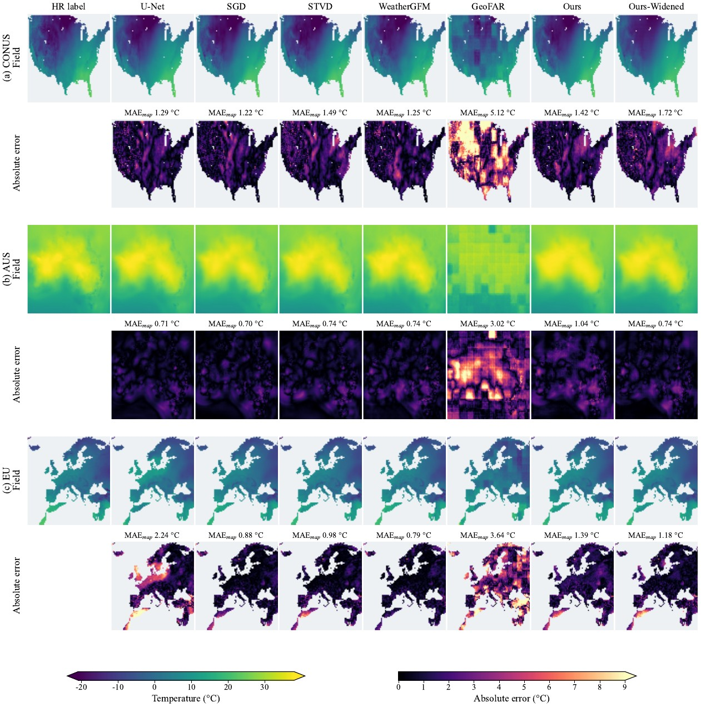
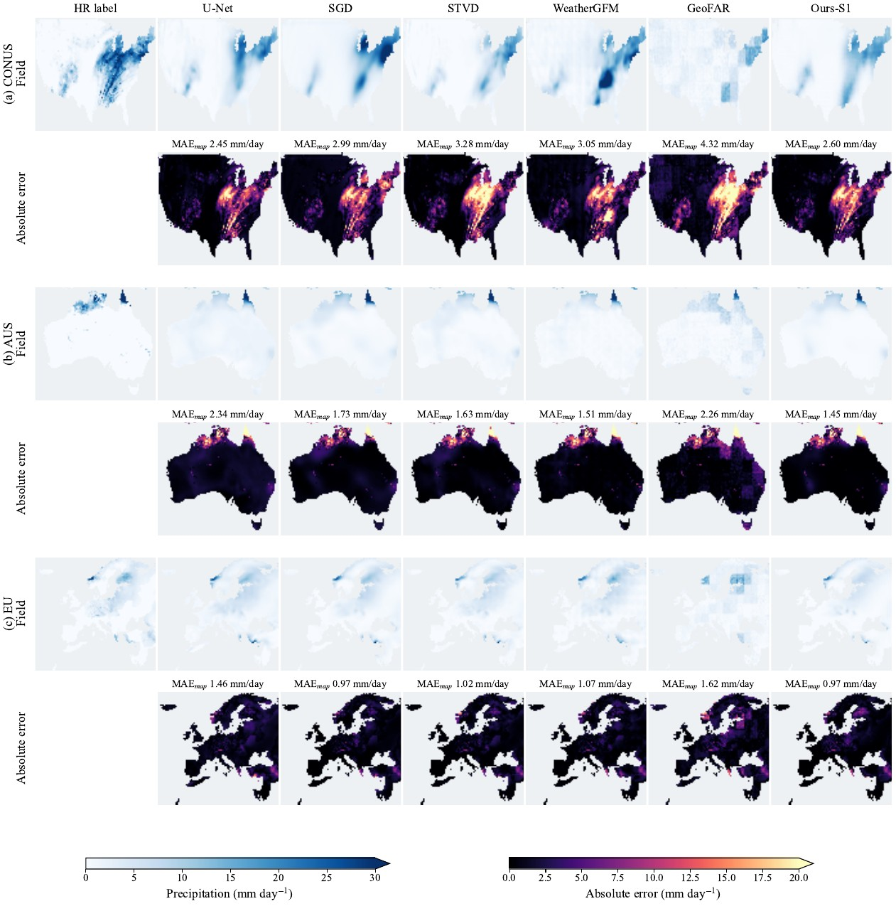

# DriveGuard-WM

Official PyTorch implementation of **DriveGuard-WM: Dynamic-Only Cross-Region Meteorological Downscaling**.

DriveGuard-WM studies strict single-source zero-shot transfer: the model is trained with dynamic low-resolution (LR) weather sequences and paired high-resolution (HR) targets in one region, then deployed in unseen regions using dynamic LR inputs only. The method combines a hierarchical world model, source-only state/relation diagnosis, an LR-only relation student, dual prediction paths, and a monotone risk guard.



Across six directed transfers among Australia, CONUS, and Europe, DriveGuard-WM reduces normalized macro MAE over the strongest common-protocol baseline by **38.6% for temperature** and **46.0% for precipitation**.

### Prediction examples

Temperature:



Precipitation:



Raw predictions and evaluation outputs are not included in this repository.

## Installation

```bash
python -m venv .venv
source .venv/bin/activate
pip install -r requirements.txt
```

## Data layout

The recommended pre-packed format is:

```text
data_root/
├── lr_seq/{train,val}/*.npy   # [T, C, H_lr, W_lr]
├── hr_seq/{train,val}/*.npy   # [T, 1, H_hr, W_hr]
├── lr_variables.json          # per-channel normalization statistics
└── land_mask.npy              # optional, [H_hr, W_hr]
```

Daily files under `lr/{train,val}` and `hr/{train,val}` are also supported and are assembled into sliding windows at load time. The experiments use `T=5` and seven dynamic ERA5 channels; no static geography, coordinates, climatology, or region identifiers are model inputs.

## Usage

Train the hierarchical world model and historical Path A:

```bash
python script/trainer_driveguard_wm.py \
  --train_dir /path/to/source \
  --val_dir /path/to/source \
  --test_dir /path/to/unseen_target \
  --T 5 --batch_size 1 --epochs 100 \
  --output_dir outputs --exp_name source_s1
```

Run Path-A inference from the resulting checkpoint:

```bash
python script/infer_driveguard_wm.py \
  --checkpoint outputs/source_s1/best_model_dgwm_*.pth \
  --data_dir /path/to/unseen_target \
  --output_dir outputs/predictions \
  --mode path_a
```

The complete research pipeline is organized by paper stage:

| Stage | Entry point |
|---|---|
| Diagnose state interventions | `script/run_e1_state_intervention.py` |
| Relation teacher and LR-only student | `script/run_e2_matrix_validation.py` |
| Current-field Path B | `script/run_e3_dual_path_ablation.py` |
| Guard training and routing evaluation | `script/run_e4_controller.py` |
| Guard calibration | `script/run_e4_calibration.py` |

Full inference uses the S1 world-model checkpoint together with the Student, Path-B, and Controller checkpoints:

```bash
python script/infer_driveguard_wm.py \
  --checkpoint /path/to/s1_world_model.pth \
  --student_checkpoint /path/to/best_student.pth \
  --path_b_checkpoint /path/to/path_b_trained.pth \
  --controller_checkpoint /path/to/best_controller.pth \
  --data_dir /path/to/unseen_target \
  --output_dir outputs/predictions \
  --mode full
```

Checkpoints, datasets, logs, and generated prediction arrays are intentionally excluded. The paper is under review; citation metadata will be added after publication.
